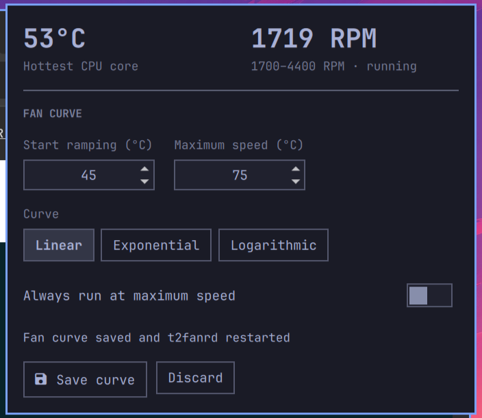

# T2 Fan Control for Omarchy

An Omarchy Shell bar widget for monitoring Apple T2 Mac thermals and editing
the existing `t2fanrd` fan curve.



It displays the hottest CPU core and every fan exposed by `applesmc`. One-fan
Macs keep the compact hero view; two-fan models gain a small per-fan RPM list.

## Requirements

- An Apple T2 Mac with the `applesmc` kernel driver
- `t2fanrd` installed and enabled
- `pkexec`/PolicyKit for authenticated configuration changes

The widget reads fan speed and temperatures without privilege. Saving a curve
opens a graphical administrator prompt, validates all values, backs up
`/etc/t2fand.conf` to `/etc/t2fand.conf.bak`, and restarts `t2fanrd`. If the
restart fails, the helper restores the previous configuration automatically.

## Install

```bash
omarchy plugin add https://github.com/Endijs/omarchy-t2-fan-control.git --enable
```

For local development, place the repository at
`~/.config/omarchy/plugins/io.github.endijs.t2-fan-control`, then run:

```bash
omarchy plugin validate ~/.config/omarchy/plugins/io.github.endijs.t2-fan-control
omarchy-shell shell rescanPlugins
omarchy plugin enable io.github.endijs.t2-fan-control --section right
```

## Fan curves

- `linear`: even ramp between the low and high temperature
- `exponential`: quieter initially, steeper near the high temperature
- `logarithmic`: stronger cooling earlier in the range

`always_full_speed` is available for temporary diagnostics, but is not intended
as the normal operating mode.

## Remove

```bash
omarchy plugin remove io.github.endijs.t2-fan-control
```

Removing the plugin does not remove `t2fanrd` or change `/etc/t2fand.conf`.

## Security

The status path is unprivileged and reads only sysfs, `/etc/t2fand.conf`, and
the `t2fanrd` service state. Saving deliberately invokes `pkexec`, so every
configuration change requires the desktop's normal administrator prompt. The
helper accepts only bounded integer temperatures, three known curve names, and
a boolean full-speed value. It creates `/etc/t2fand.conf.bak` and restores it
automatically if `t2fanrd` fails to restart.

## License

MIT
